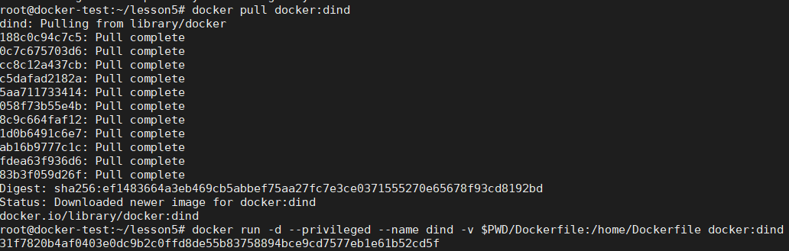
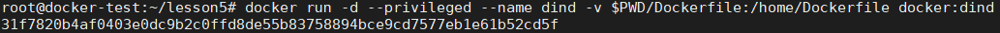
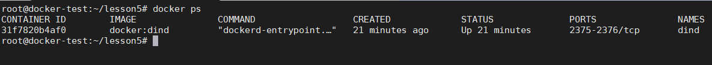
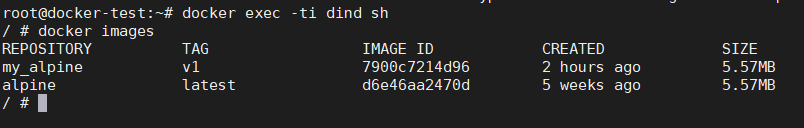
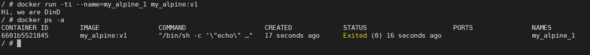

# Сборка контейнера в контейнере (lesson 1.5)

1. Качаем image с внешнего репозитория:

 

2. Запускаем скаченный образ, передаем наш Dockerfile:

 

3. Смотрим запущен ли он:

4. Подключаемся к нему и делаем сборку нашего Dockerfile уже внутри созданного контейнера:

 (образ был подготовлен)

5. Запустим контейнер и покажем, что он выполнил своё предназначение):

_Dockerfile_ содержит простую команду на приветствие
